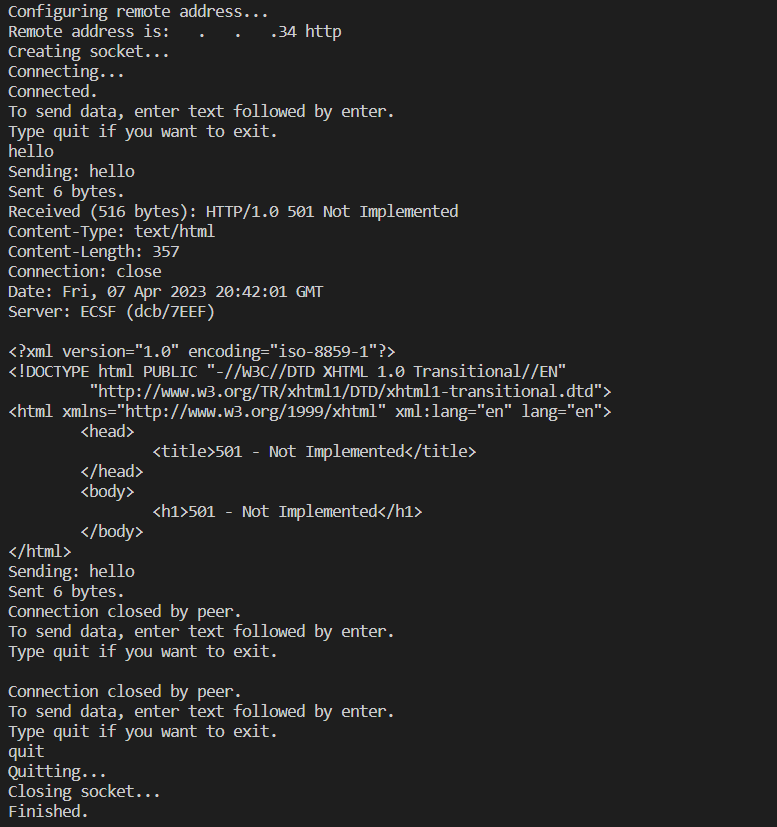

## What is a Server/Client Relationship
A Server and client relationship describes how a server can provide resources or services to one or more clients. The client makes a service request from the server, whose job is it is to fulfill the request. In networking terms, the client/server relationship provides means for computers located in different locations to communicate with each other. This relationship allows devices to share and deliver data/information from one device to another device acting like a server.

## The Need for a Message in Transit Within the Server/Client Relationship
When the client is able to connect to the server side, it is commonly doing so through TCP/IP protocols. TCP is a connection-oriented protocol, meaning that the TCP protocol will maintain the connection until the programs on both of the devices have done exacting messages. TCP protocol is great for determining how to break messages into packages, it's also able to send and accept packages from layer 3 of the OSI model, and if the transmission of a message drops, TCP is able to handle the retransmission of the package. But TCP protocols are most known for acknowledging packets with the three-way handshake.

## The Risks of a Message in Transit Within the Server/Client Relationship
Client\server relationships possess many disadvantages. In some cases, the availability of the server can be affected by the simultaneous request by different clients. This can make the server to be overloaded with requests, resulting in congestion on the network or DoS attack. With a failing server none of the requests made by the client will be fulfilled, leading to a client-server failure.
Other risks related to messages in transit include active attacks like impersonating another client/user or altering messages in transit between client and server. Messages in transit are also at risk of getting exposed to confidentiality threats like eavesdropping attacks, ramose ware attacks, and data theft.

